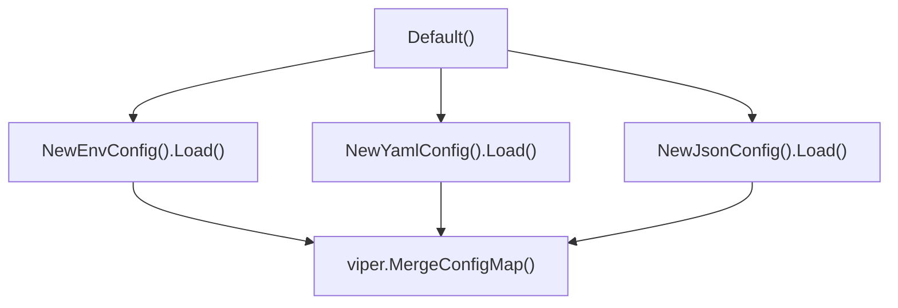
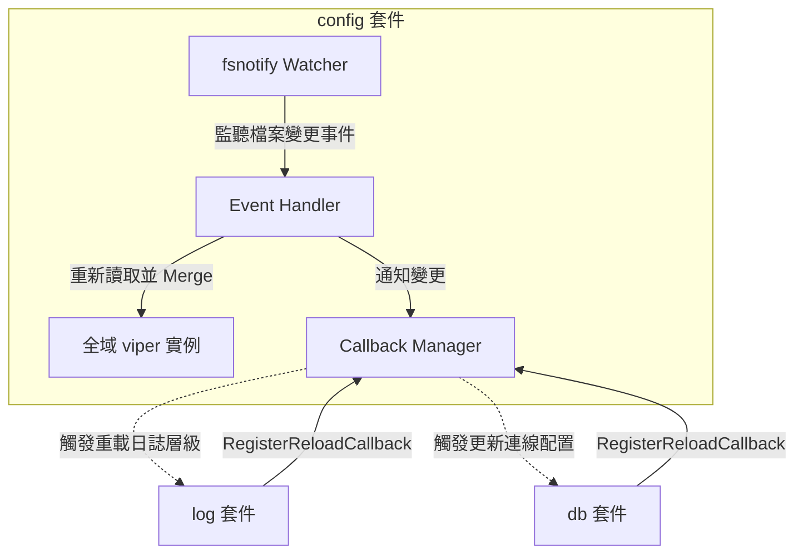

# 架構計畫 — config-dynamic-reload (Architecture Plan)

## 1. 目標與範圍 (Goal & Scope)

本計畫旨在規劃 `config-dynamic-reload` 功能。`開發者與維運人員 (Developers and Operators)` 能透過此功能在不重啟應用程式的情況下，動態監聽並重新載入本地設定檔，使系統即時套用最新的環境變數與參數配置。

### 非本功能範圍 (Out of Scope)

- 不提供前端或圖形介面 (GUI) 以供編輯或檢視設定。
- 不實作資料庫連線的動態重連與重新初始化，資料庫連線生命週期由 `db` 套件維護，本功能僅提供通知變更回呼 (callback)。
- 不處理遠端設定中心（例如 Consul、Etcd 或 Apollo 等）的整合，僅基於本地檔案系統 (local filesystem) 的變更監聽。
- 不處理高併發讀寫競爭的鎖機制 (lock mechanism)，僅更新全域 `viper` 設定值並發送回呼 (callback)，不為每個欄位設計讀寫鎖。

## 2. 現況架構 (Current Architecture)

現行的設定管理模組 `config` 依靠 `viper` 載入設定。在呼叫 `config.Default` 時，會按順序分別載入環境變數、`YAML` 與 `JSON` 設定檔並合併到全域 `viper` 中。

### 頂層結構 (Top-level Structure)

```tree
gosdk/
├── main.go                  # HTTP 伺服器入口
├── go.mod                   # Go 1.26
├── Makefile                 # 建置/測試指令
├── version                  # 版本號檔案
├── build/                   # 建置相關
│   └── dockerfile           # Docker 設定
├── cmd/                     # 命令行工具
│   ├── gotmpl/              # 模板渲染
│   ├── stringer/            # 列舉產生器
│   ├── versioning/          # 版本管理
│   └── cobrasample/         # Cobra 範例
├── config/                  # 設定管理模組
│   ├── config.go            # 設定載入進入點
│   ├── option.go            # 設定參數選項
│   ├── env.go               # dotenv 載入
│   ├── yaml.go              # YAML 載入
│   ├── json.go              # JSON 載入
│   └── embedFS.go           # embedFS 載入
├── db/                      # 資料庫連線模組
│   ├── db.go                # DB 介面
│   ├── sqlite.go            # SQLite 連線
│   ├── mysql.go             # MySQL 連線
│   └── postgres.go          # Postgres 連線
├── encode/                  # 編碼轉換模組
├── log/                     # 結構化日誌模組
├── mw/                      # Gin 中介層
├── metric/                  # 指標監控模組
├── notify/                  # 通用通知模組
├── router/                  # HTTP 路由定義
├── scheduler/               # 排程管理模組
├── server/                  # HTTP 伺服器模組
├── service/                 # 核心服務邏輯
├── time/                    # 時間工具模組
└── utils/                   # 通用工具函式
```

### 進入點 (Entry Points)

- [config/config.go](file:///Users/shuk/projects/tmp/gosdk/config/config.go) 中的 `config.Default` 函式。

### 相關既有模組與檔案 (Related Modules & Files)

- [config.go](file:///Users/shuk/projects/tmp/gosdk/config/config.go)
- [option.go](file:///Users/shuk/projects/tmp/gosdk/config/option.go)
- [env.go](file:///Users/shuk/projects/tmp/gosdk/config/env.go)
- [yaml.go](file:///Users/shuk/projects/tmp/gosdk/config/yaml.go)
- [json.go](file:///Users/shuk/projects/tmp/gosdk/config/json.go)

### 高改動熱點 (High Modification Hotspots)

根據過去 6 個月 `Git` 提交統計，相關模組的改動頻率如下：
- `config/config.go`：共變更 `18` 次。
- `config/json.go`：共變更 `10` 次。
- `config/yaml.go`：共變更 `9` 次.
- `config/env.go`：共變更 `9` 次。

### 現況架構圖 (Current Architecture Diagram)



## 3. 架構位置與邊界 (Placement & Boundaries)

動態重載與監聽邏輯將全面封裝於 `config` 套件中，確保外部呼叫端僅需以簡單的註冊機制介接。

### 位置與設計理由 (Placement & Rationale)

- 置於 `config/` 套件內。因為設定檔的監聽、載入及全域合併皆屬於設定管理的核心生命週期，應由設定模組內部實現，不應將 `fsnotify` 變更細節曝露到外部。

### 邊界定義 (Boundaries)

- 本功能 `擁有`：監聽設定檔目錄的監聽器、檔案變更事件的防抖動 (debounce) 機制、註冊動態重載回呼的列表。
- 本功能 `不碰`：不主動重新初始化資料庫或重啟 `HTTP` 伺服器，僅於設定更新後通知已註冊的回呼函式。

## 4. 介面與資料流 (Interfaces & Data Flow)

為了將動態載入的行為以最簡單的方式暴露給呼叫端，設計以下介面合約：

### 介面設計 (API Contract)

| 介面/方法名稱 | 輸入參數 | 輸出參數 | 錯誤情況與行為 |
| :--- | :--- | :--- | :--- |
| `WithWatch` | `onReload func(err error)` | `ConfigOption` | 於 `config.Default` 中啟用設定檔監聽並註冊初始回呼。若初始化監聽器失敗，會將錯誤傳遞給 `onReload` 回呼。 |
| `RegisterReloadCallback` | `name string`, `callback func(err error)` | (無) | 註冊新的回呼函式。若名稱重複則覆蓋。若傳入 `callback` 為 `nil`，則不進行註冊。 |
| `UnregisterReloadCallback` | `name string` | (無) | 移除指定名稱的回呼函式。若名稱不存在，則無操作。 |
| `StartWatch` | (無) | `error` | 啟動設定檔目錄背景監聽。若監聽器已啟動則回傳 `ErrWatcherAlreadyRunning` 錯誤；若監聽目錄不存在或初始化失敗，則回傳對應的系統錯誤。 |
| `StopWatch` | (無) | `error` | 停止背景監聽並釋放 `fsnotify` 資源。若未啟動監聽器則回傳 `ErrWatcherNotRunning` 錯誤。 |

### 資料流圖 (Data Flow)



## 5. 清晰與可擴充性檢查 (Clarity & Scalability Check)

逐項回答 `是` / `否` / `不適用`，每項附一句理由：

1. 單一職責：`是`。新模組只有一個變更理由，即設定監聽與回呼分發。
2. 依賴方向：`是`。沒有內層指向外層，沒有循環相依。外部模組向 `config` 註冊回呼，維持由外向內的依賴方向。
3. 可替換：`是`。外部依賴（如監聽工具 `fsnotify`）都被隔在介面後面，未來可替換為其他監聽工具或輪詢機制。
4. 水平擴充：`不適用`。僅負責進程記憶體內的全域狀態更新。
5. 擴充點：`是`。新開發的模組只需呼叫 `RegisterReloadCallback` 即可接軌動態設定更新。

## 6. 漸進落地步驟 (Incremental Steps)

| 步驟 (Step) | 做什麼 (What) | 驗證 (Verify) | 回滾 (Rollback) |
| :--- | :--- | :--- | :--- |
| 1. 實作回呼管理器與 Option | 在 `config/` 新增 `watcher.go`，實作 `CallbackManager`、`RegisterReloadCallback` 與 `UnregisterReloadCallback` 函式。在 `option.go` 中新增 `WithWatch` Option。 | 撰寫單元測試，驗證註冊 Callback 後，手動觸發 Reload 能正確執行所有註冊的回調並接收錯誤。 | 刪除 `watcher.go` 中相關程式碼，並還原 `option.go` 的修改。 |
| 2. 實作 fsnotify 檔案監聽與重新載入 | 在 `watcher.go` 中實作 `StartWatch`，使用 `fsnotify` 監聽設定檔所在目錄（如 `.`, `./conf`, `GetAppConfigDir()`）。當檔案寫入完成時，重新載入設定並調用 `viper.MergeConfigMap` 更新全域設定，最後呼叫 callbacks。 | 撰寫單元測試，模擬動態寫入 `config.local.yaml`，確認全域 `viper` 的設定值被即時更新，且對應的回調被觸發。 | 還原 `watcher.go` 中的 `StartWatch` 邏輯。 |
| 3. 將 log 套件接軌動態設定變更 | 在 `log.go` 中新增公開的 `Init()` 函式以供呼叫。並在初始化時，註冊回調以在日誌設定變更時自動呼叫 `log.Init()`，調整日誌等級。 | 執行集成測試，動態變更 `LOG_LEVEL` 檔案，驗證在不重啟程式下，`slog` 的輸出層級隨之改變。 | 註銷 `log` 中的 reload callbacks，還原修改。 |
| 4. 主程式啟用與全面驗證 | 在 `main.go` 或 `cobrasample/main.go` 啟用 `config.Default(config.WithWatch(nil))`，並執行 `make test` 確保全模組無誤。 | 執行 `make test` 和 `make build` 確保無編譯與單元測試錯誤。 | 還原 `main.go` 中的配置。 |

## 7. 風險與假設 (Risks & Assumptions)

- 假設一：應用程式主要部署在具備本地檔案系統的容器或伺服器中，`fsnotify` 檔案監聽機制能如常運作。
- 假設二：多個設定檔（`.env`、`config.yaml`、`settings.json`）同時變更時，需要防抖動 (debounce) 機制以避免連續多次觸發重載，計畫中預設採用短暫延遲的定時防抖。
