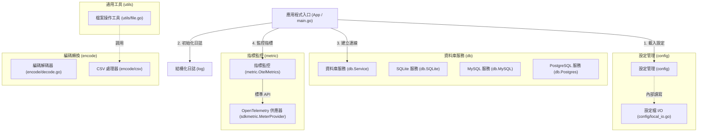

# 架構演進與優化計畫 — gosdk (Architecture Evolution & Optimization Plan)

## 1. 現有架構診斷與技術債 (Architecture Diagnosis & Technical Debt)

- `設定載入與公用工具的傳遞依賴 (Transitive Dependency between Config and Utils)`：
  在 [option.go](file:///Users/shuk/projects/tmp/gosdk/config/option.go) 中，設定載入模組引入並依賴了 [utils](file:///Users/shuk/projects/tmp/gosdk/utils) 套件的 `utils.CreateIfNotExist`。然而，[file.go](file:///Users/shuk/projects/tmp/gosdk/utils/file.go) 卻依賴了 [csv](file:///Users/shuk/projects/tmp/gosdk/encode/csv) 與外部第三方套件 `github.com/gocarina/gocsv`。這導致底層的 `config` 模組被迫傳遞依賴了高階的 CSV 編碼與處理器，破壞了基礎套件應作為葉子節點、不依賴具體業務與編碼套件的設計原則。

- `資料庫連線服務與設定管理之強耦合 (Strong Coupling in Database and Configuration)`：
  在 [sqlite.go](file:///Users/shuk/projects/tmp/gosdk/db/sqlite.go)、[mysql.go](file:///Users/shuk/projects/tmp/gosdk/db/mysql.go) 與 [postgres.go](file:///Users/shuk/projects/tmp/gosdk/db/postgres.go) 中，資料庫初始化函式（例如 `InitSQLite`）直接調用了 `viper.GetString` 以獲取連線設定。此種 `Flat viper keys` 直讀設計雖然方便，但將資料庫連線邏輯與全域的 `viper` 單例強綁定，導致無法在沒有 `viper` 載入設定的情況下進行獨立的連線測試或自訂連線。

- `日誌套件之初始化載入缺陷 (Logging Initialization Load Defect)`：
  [log.go](file:///Users/shuk/projects/tmp/gosdk/log/log.go) 使用 Go 語言的 `init()` 進行自動初始化，以設定 `slog` 的全域 logger。然而，整個專案原始碼（包括 [main.go](file:///Users/shuk/projects/tmp/gosdk/main.go)）均未匯入 `github.com/bizshuk/gosdk/log`，導致該 `init()` 函式在運行時根本不會被執行，全域 `slog` 依然使用系統預設的 text logger，無法套用 `LOG_LEVEL` 與 `LOG_FORMAT` 的設定。

- `套件命名冗餘與目錄結構分歧 (Package Naming Redundancy & Path Divergence)`：
  `encode/io` 目錄下的原始碼檔案聲明為 `package encode`。這導致外部調用端必須使用別名，如 `import encode "github.com/bizshuk/gosdk/encode/io"`，造成目錄路徑與套件名稱不一致的混淆。

- `未導出的 HTTP 伺服器設計 (Unexported HTTP Server Design)`：
  [main.go](file:///Users/shuk/projects/tmp/gosdk/main.go) 將 `HTTPServer()` 函數置於 `package main` 中，使得其他 Go 專案無法將其作為程式庫（library）匯入重用，與 SDK 作為可嵌入服務基礎模組的定位不符。

- `測試環境與沙盒限制之衝突 (Conflict between Test Environment and Sandbox Limits)`：
  在沙盒 (Sandbox) 環境下執行測試時：
  1. `utils` 套件的測試會因嘗試寫入外部使用者目錄 `/Users/shuk/` 而遭遇權限拒絕錯誤，因為沙盒限制了對工作區外部目錄的寫入權限。
  2. `metric` 套件的測試會嘗試向外部的 `localhost:8428` 等真實端點發送 TCP 請求，而在沙盒環境下這會因缺少網路權限而失敗。

- `OpenTelemetry 規格實作不一致與缺失 (Inconsistent OTel Metrics Specification & Gaps)`：
  根據 [SPEC.md](file:///Users/shuk/projects/tmp/gosdk/SPEC.md) 定義，Go 監控端應提供 `OtelMetrics` 結構、`NewOtelMetrics` 建構子，以及 `ProcessCounter`、`ProcessHistogram` 與 `RecordProcessWithDuration` 等上層指標封裝，以便外部專案進行程序指標監控。目前 [otel.go](file:///Users/shuk/projects/tmp/gosdk/metric/otel.go) 僅有低階 Provider 初始化，缺乏高階抽象。

- `程式碼生成器定位混雜 (Ambiguous Location of Code Generator)`：
  [generator.go](file:///Users/shuk/projects/tmp/gosdk/service/generator.go) 為 `cmd/stringer` 工具的核心產生器邏輯，直接置於 `service` 根目錄下，缺乏子套件隔離，容易與未來的業務 `service` 混淆。

## 2. 複雜度量測 (Complexity Metrics)

### 原始碼行數與主要檔案 (Code Size & Major Files)

本專案 Go 原始碼檔案之程式碼行數（排除測試與 vendor）排名前列者如下：

- [generator.go](file:///Users/shuk/projects/tmp/gosdk/service/generator.go) — `549` 行（包含 AST 解析與 `stringer` 生成邏輯，為最複雜的單一邏輯檔案）
- [file.go](file:///Users/shuk/projects/tmp/gosdk/utils/file.go) — `323` 行（包含一般讀寫、備份、CSV 讀寫與回呼，職責過度混雜）
- [main.go](file:///Users/shuk/projects/tmp/gosdk/cmd/stringer/main.go) (stringer CLI) — `208` 行
- [metric.go](file:///Users/shuk/projects/tmp/gosdk/metric/metric.go) — `163` 行

### 改動頻率與熱點分析 (Change Frequency & Hotspot Analysis)

根據過去 `12個月` 之 `git log` 統計，變更最為頻繁的檔案統計如下：

- [config.go](file:///Users/shuk/projects/tmp/gosdk/config/config.go) — `25` 次
- [env.go](file:///Users/shuk/projects/tmp/gosdk/config/env.go) — `16` 次
- [log.go](file:///Users/shuk/projects/tmp/gosdk/log/log.go) — `14` 次
- [yaml.go](file:///Users/shuk/projects/tmp/gosdk/config/yaml.go) — `14` 次
- [file.go](file:///Users/shuk/projects/tmp/gosdk/utils/file.go) — `13` 次
- [json.go](file:///Users/shuk/projects/tmp/gosdk/config/json.go) — `13` 次

改動頻繁之檔案多集中於設定管理與公用工具，顯示這兩個模組為系統的核心重構熱點。

### 依賴圖與扇入/扇出分析 (Dependency Fan-in/out Analysis)

- 扇出 (Fan-out) 熱點：`utils` 套件。作為底層輔助庫，其引入了 `github.com/bizshuk/gosdk/encode/csv` 與 `github.com/gocarina/gocsv`，進而傳遞依賴給 `config` 套件，形成依賴扇出之源頭。
- 核心依賴路徑：
  `config/option.go` -> `utils/file.go` -> `encode/csv/csv.go`
  這造成了底層套件的循環與高依賴。
- 扇入 (Fan-in) 熱點：`github.com/spf13/viper` 被多個子模組（`config`、`db`、`log`、`metric`、`router`、`time`）直接參考，形成了全域單例耦合。

## 3. 架構簡化與解耦設計 (Simplification & Decoupling Design)

為解決上述耦合問題，重新設計以下解耦架構：



### 核心解耦策略 (Core Decoupling Strategies)

1. `設定載入器與 utils 解耦 (Decouple Config from Utils)`：
   將 `utils.CreateIfNotExist` 提取並改寫為 `config` 套件內部的私有輔助函式 `createIfNotExist`，解除 `config` 套件對 `utils` 的直接引用，使其不再傳遞依賴 `gocsv` 與 `encode/csv`。

2. `分離 CSV 處理邏輯 (Isolate CSV Processing)`：
   將 `utils/file.go` 中所有與 CSV 及 `gocsv` 相關的函式（`WriteCSV`、`ParseCSVFile`、`NewCSVFilelistCallback`、`LoadCSV`）全部移動到 `encode/csv` 子包。使 `utils` 包回歸純粹的檔案 IO 工具，解除對高階業務模組與第三方 CSV 函式庫的依賴。

3. `資料庫連線服務之顯式參數建構子 (Explicit Constructors for Database Services)`：
   在 `db` 模組中，為 SQLite、MySQL 與 Postgres 提供帶有連線參數的工廠建構子，例如 `NewSQLite(path string) (*SQLite, error)`。全域初始化函式 `InitSQLite()` 則作為 Viper 設定的便利 wrapper 呼叫新建構子，確保底層資料庫連線可脫離 Viper 獨立建構與測試。

4. `日誌套件導出顯式初始化與配置方法 (Export Explicit Logger Configuration)`：
   在 `log` 套件中新增並導出 `Init()` 函數。此函數在 `config.Default()` 載入設定後，從 `viper` 讀取 `LOG_LEVEL` 與 `LOG_FORMAT` 以重構全域的 `slog.Logger`。同時，修改原有的 `init()` 僅作基本的 stdout text fallback 兜底。

5. `重構 HTTP 伺服器模組 (Refactor HTTP Server Module)`：
   將 `main.go` 中的 `HTTPServer()` 重構至一個新的子包 `server`（如 `server/server.go`）中並聲明為 `package server`。而 `main.go` 僅作為應用程式入口點，調用 `server.HTTPServer()`。

6. `修正套件目錄結構語義 (Resolve Package Directory Stutter)`：
   將 `encode/io/` 目錄下的所有原始碼檔案直接移動到 `encode/` 目錄下，並將包名統一為 `encode`，消除別名 `import encode "github.com/bizshuk/gosdk/encode/io"` 的冗餘。

7. `修復測試沙盒限制 (Fix Test Sandbox Limitations)`：
   - 檔案寫入：在 `utils/file_test.go` 中，將 `t.Setenv("HOME", t.TempDir())` 注入 `CreateIfNotExist` 涉及 `~` 路徑的測試中，防止寫入真實使用者目錄導致的權限錯誤。
   - 網路連線：在 `metric/` 單元測試中，使用 `httptest.NewServer` 模擬 Promwrite 接收端，或使用 `otel` 內建的 `noop` / 記憶體傳輸層進行指標匯出測試，避免向 `localhost` 發送真實的 TCP 請求。

## 4. 目錄與模組重整方案 (Reorganization Map)

### 重整後目錄樹 (Reorganized Directory Tree)

```tree
gosdk/
├── main.go                  # 入口，調用 server.HTTPServer()
├── server/
│   └── server.go            # 導出可重用的 HTTPServer() 函數
├── config/
│   ├── config.go            # 包含 Schema 結構體定義與 LoadConfig 函數，不再引入 utils
│   └── local_io.go          # 包含私有的 createIfNotExist 邏輯，解除對 utils 的依賴
├── db/
│   ├── sqlite.go            # 導出 NewSQLite(path string)，InitSQLite 作為便利封裝
│   ├── mysql.go             # 導出 NewMySQL(dsn string)，InitMySQL 作為便利封裝
│   └── postgres.go          # 導出 NewPostgres(dsn string)，InitPostgres 作為便利封裝
├── encode/
│   ├── decode.go            # 從 encode/io/ 遷移而來
│   ├── gbk.go               # 從 encode/io/ 遷移而來
│   ├── big5.go              # 從 encode/io/ 遷移而來
│   └── csv/
│       ├── processor.go     # 收容從 utils 遷移來的 NewCSVFilelistCallback
│       └── csv.go
├── utils/
│   └── file.go              # 純粹的文件輔助工具，解除對 encode/csv 的依賴
```

### 遷移映射表 (Migration Map)

| 原始檔案與邏輯 (Source) | 目標路徑 (Target) | 依賴關係變化與說明 (Description) |
| :--- | :--- | :--- |
| `utils/file.go` (CSV 操作) | `encode/csv/utils.go` | 將 `WriteCSV`, `ParseCSVFile`, `NewCSVFilelistCallback`, `LoadCSV` 移動至 `encode/csv`，解除 `utils` 對 `encode/csv` 的依賴。 |
| `config/option.go` (CreateIfNotExist) | `config/local_io.go` | 將 `CreateIfNotExist` 私有化為 `createIfNotExist` 並寫入 `config` 內部，解除 `config` 對 `utils` 的引用。 |
| `service/generator.go` | `service/stringer/generator.go` | 將 `stringer` 生成器程式碼歸類到專屬的子套件中，使根目錄結構清晰。 |
| `encode/io/` (所有檔案) | `encode/` | 移動所有解碼檔案至 `encode/` 根目錄，消除 `encode/io` 包名與目錄的不一致。 |
| `main.go` (HTTPServer) | `server/server.go` | 移動 `HTTPServer()` 到 `server` 包中，使其能被其他專案作為程式庫引用。 |

## 5. 插件化與可擴充性機制 (Plugin & Extensibility Mechanism)

基於 Go SDK 的靜態編譯與模組設計特徵，可擴充性以 `介面與組合 (Interface & Composition)` 方式實現，避免過度設計：

1. `設定加載器擴充點 (Config Loader Extensibility)`：
   目前 `config.Default()` 寫死了載入 Env、Yaml、Json 設定的順序。為支援自訂加載器，可重構 `config.Default` 接受一個 `Config` 介面切片：
   ```go
   func Default(loaders []Config, opts ...ConfigOption)
   ```
   如此一來，外部使用者可自由傳入 `NewFSConfig(...)` 或其他自訂實作，大幅提升可擴充性。

2. `資料庫服務與驅動擴充點 (Database Service Extension)`：
   `db/db.go` 中定義的 `Service` 介面，為連線的標準契約。未來若有新型態的資料庫（如 Redis 或 MSSQL）要整合，僅需實作 `Service` 介面（即 `DB()` 與 `Close()`），並提供對應的 `NewDatabase` 建構子，即可無縫嵌入系統。

3. `通知發送器擴充點 (Notifier Extension)`：
   `notify/notifier.go` 中定義了 `Notifier` 介面。`Multi` 組合通知器即為一種插件式設計，能動態組合 `SlackNotifier` 與 `StdoutNotifier`。若未來需要支援其他即時通訊平台（如 Discord），僅需實作 `Notifier` 介面，不需更動任何既有核心模組。

## 6. 漸進式重構路徑與驗證 (Refactoring Roadmap & Verification)

本重構遵循 `絞殺榕模式 (Strangler-Fig Pattern)`，確保每次變更皆有對應的單元測試保護，且每一步都可單獨提交與回滾。

### 階段一：建立測試安全網與環境解耦 (Characterization Test & Environment Decoupling)

- `目標`：
  1. 在 `utils/file_test.go` 中加入 `t.Setenv("HOME", t.TempDir())` 覆寫，修復 `CreateIfNotExist` 在沙盒環境下對 `/Users/shuk/` 目錄的寫入權限問題。
  2. 在 `metric` 單元測試中，將對真實網路的依賴改為 `httptest.NewServer` 或是 Mock，移除對真實 `localhost` 通訊的依賴。
- `驗證`：
  執行 `go test -v ./...` 確保測試綠燈，且 `metric` 與 `utils` 測試不再產生真實的外部網路請求與非法路徑寫入。

### 階段二：解耦公用庫與重構目錄結構 (Decouple Utils & Reorganize Directory Structure)

- `目標`：
  1. 在 `config` 中重構 `applyOptions`，把對 `utils.CreateIfNotExist` 的引用替換為內建的 `createIfNotExist` 私有函式。
  2. 將與 CSV 和 `gocsv` 相關的函式搬移至 `encode/csv/utils.go`，修正 `utils/file.go` 的 import 宣告，移除 `encode/csv` 和 `gocsv`，使 `utils` 成為葉子節點。
  3. 將 `encode/io/` 下的所有檔案搬遷至 `encode/` 目錄。
- `驗證`：
  1. 執行 `go test -v ./config/... ./utils/... ./encode/...` 確保測試通過。
  2. 檢查 `go list -f '{{.Imports}}' ./utils` 確認不再含有 `encode/csv` 與 `gocsv` 的依賴。

### 階段三：提供 db 顯式參數建構子與重構日誌套件 (Provide DB Constructors & Logger Init)

- `目標`：
  1. 在 `db/sqlite.go`、`db/mysql.go` 與 `db/postgres.go` 中實作傳入 `path/dsn` 的 `NewSQLite`、`NewMySQL` 與 `NewPostgres` 函式。
  2. 重構 `InitSQLite`、`InitMySQL` 與 `InitPostgres` 使用 these 建構子。
  3. 在 `log/log.go` 中新增並導出 `Init()` 函數，使能在 `config.Default()` 載入設定後，從 `viper` 重新套用 `LOG_LEVEL` 與 `LOG_FORMAT` 於全域 `slog.Logger`。
- `驗證`：
  1. 執行 `go test -v ./db/... ./log/...` 確保測試通過。
  2. 編寫測試驗證可以不經由 `viper` 建立獨立的資料庫連線，且能在設定載入後成功套用新的日誌級別。

### 階段四：重構 HTTP 伺服器模組與對齊 OTel 指標規格 (Export HTTP Server & Align OTel Metrics)

- `目標`：
  1. 將 `main.go` 中的 `HTTPServer()` 移入 `server/server.go` 中，並修改 `main.go` 調用 `server.HTTPServer()`.
  2. 在 `metric/otel.go` 中實作 `OtelMetrics` 結構、`NewOtelMetrics` 建構子，以及 `ProcessCounter`、`ProcessHistogram` 與 `RecordProcessWithDuration` 等方法，使 Go 與 Python 版本之指標監控語義完全對齊。
- `驗證`：
  1. 執行 `go test -v ./...` 確認系統順利啟動。
  2. 在 `metric/otel_test.go` 中撰寫對應的單元測試，驗證指標之 `counter` 和 `duration histogram` 被正確註冊與發送。

## 7. 風險與回滾策略 (Risks & Rollback)

- `向下相容性中斷風險 (Compatibility Risk)`：
  將 CSV 處理函式從 `utils` 移動至 `encode/csv`，以及變更資料庫初始化函數簽名，可能導致依賴此 SDK 的外部專案在升級時發生編譯錯誤。
  - `對策與回滾`：在 `utils/file.go` 中，保留 these CSV 函式的 `Deprecated` 版本，並在內部轉向調用 `encode/csv`。對資料庫初始化也保留舊有的全域無參數初始化方法（例如 `db.InitSQLite()`），標記為 `Deprecated`，確保現有用戶的 API 相容性，待未來大版本發行時再予以移除。

- `資料庫連線未初始化的錯誤 (Database Uninitialized Risk)`：
  重構資料庫流程可能導致依賴全域 `db.DefaultSQLite` 等實例的呼叫端，在尚未調用 `Init` 之前取到 `nil` 指標而發生恐慌 (Panic)。
  - `對策與回滾`：在 `db.Default*` 被存取時（或在建構子中），加入明確的守護與狀態驗證，並在 `DB()` 方法中提供更具描述性的 `nil` 指標恐慌提示或直接返回適當的錯誤，而非直接觸發空指標解引用。

- `日誌漏初始化風險 (Log Uninitialized Risk)`：
  若忘記顯式呼叫 `log.Init()`，可能導致沒有日誌輸出。
  - `對策與回滾`：在 `log/log.go` 的 `init()` 中始終註冊一個預設的 stdout text 兜底 logger，確保在任何情況下程式皆能正常輸出基本日誌。
