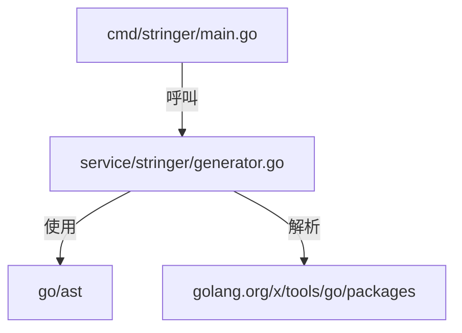
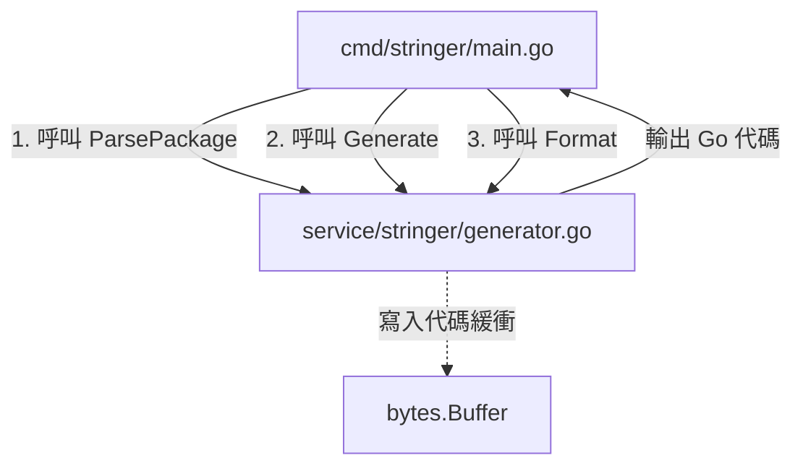

# 架構計畫 — service-generator-migration (Architecture Plan)

## 1. 目標與範圍 (Goal & Scope)

本計畫旨在將 `gosdk` 專案中原本位於 `service/generator.go` 的代碼生成器核心邏輯，遷移至獨立子套件 `service/stringer/generator.go` 中。這有助於維持 `service/` 根目錄結構的清晰性，並將該產生器與未來的其他業務 `service` 進行隔離。

不做什麼 (out of scope)：

- 不改變 `generator.go` 原有的 AST 解析或 `stringer` 代碼生成的核心邏輯。
- 不修改除 `cmd/stringer/main.go` 之外的命令或外部調用端之代碼結構。
- 不在 `service/` 根目錄下保留任何舊有的 `generator.go` 代碼 or 備份。

## 2. 現況架構 (Current Architecture)

重構前的 `service/generator.go` 混雜在 `service/` 根目錄中，容易引起調用端誤用為業務 `service`。

目前現況架構關係如下：

相關模組清單：

- `cmd/stringer/main.go`：程式碼產生器的 CLI 進入點。
- `service/stringer/generator.go`：包含 `stringer` 生成器的核心邏輯與類型定義。

## 3. 架構位置與邊界 (Placement & Boundaries)

本 feature 放置於 `service/stringer` 子套件（套件名稱為 `stringer`）下。

放置理由：

- `stringer` 屬於代碼生成的輔助工具，而非通用的業務服務。若直接置於 `service/` 根目錄下，將增加根目錄的依賴複雜度。將其置於 `service/stringer` 可以明確其作為單一獨立功能的邊界，且便於管理其特有的 AST 解析依賴。

依賴方向：

- 依賴關係為單向的，即 `cmd/stringer` 指向 `service/stringer`。`service/stringer` 僅依賴 Go 標準庫（如 `go/ast`、`go/types`）與 `golang.org/x/tools/go/packages`，不回頭指向任何 `cmd/` 目錄或 `gosdk` 的其他高階套件。

邊界清單：

- `service/stringer` 內部只處理 AST 解析、模板緩衝與 `stringer` 生成邏輯。
- `service/stringer` 不涉及資料庫連線、設定管理、結構化日誌或指標監控等其他系統模組。

## 4. 介面與資料流 (Interfaces & Data Flow)

新子套件 `service/stringer` 與 CLI 交互的介面如下表所示：

| 介面名稱 (Interface Name) | 輸入 (Input)                         | 輸出 (Output) | 錯誤情況 (Error Scenarios)                             |
| :------------------------ | :----------------------------------- | :------------ | :----------------------------------------------------- |
| `ParsePackage`            | `patterns []string`, `tags []string` | (無)          | 解析失敗或未找到 Go 檔案時在內部調用 `log.Fatalf` 中斷 |
| `Generate`                | `typeName string`                    | (無)          | 找不到指定常數定義時在內部調用 `log.Fatalf` 中斷       |
| `Format`                  | (無)                                 | `[]byte`      | 格式化失敗時返回原始 buffer 資料並寫入警告             |

資料流圖如下所示：

## 5. 清晰與可擴充性檢查 (Clarity & Scalability Check)

1. 單一職責：是。新模組僅負責 AST 的解析與 `stringer` 代碼的渲染生成。
2. 依賴方向：是。沒有內層指向外層的依賴，亦無循環相依。
3. 可替換：是。其依賴僅為 `go/ast` 等 Go 標準庫，並無外部 DB 或第三方服務依賴。
4. 水平擴充：是。`Generator` 結構體可在多個實例中獨立配置與使用，無全域共享狀態。
5. 擴充點：是。下一個同類產生器（例如其他 AST 轉換工具）可以不修改 `stringer` 核心代碼而以獨立套件形式加入。

## 6. 漸進落地步驟 (Incremental Steps)

以下為重構與驗證的漸進式落地步驟：

| 步驟 (Step)         | 做什麼 (What)                                                                                                                     | 驗證 (Verify)                                                                           | 回滾 (Rollback)                                      |
| :------------------ | :-------------------------------------------------------------------------------------------------------------------------------- | :-------------------------------------------------------------------------------------- | :--------------------------------------------------- |
| `1. 程式碼文件搬移` | 將原 `service/generator.go` 移動至 `service/stringer/generator.go`，並修改 package 名稱為 `stringer`                              | 驗證 `/Users/shuk/projects/gosdk/service/generator.go` 檔案不存在，且新路徑下包含該檔案 | 執行 `git checkout` 還原 `service/generator.go` 檔案 |
| `2. 更新呼叫端導入` | 修改 `cmd/stringer/main.go`，將其導入的路徑從 `github.com/bizshuk/gosdk/service` 改為 `github.com/bizshuk/gosdk/service/stringer` | 執行 `go build ./cmd/stringer/...` 確認編譯成功                                         | 執行 `git checkout cmd/stringer/main.go` 還原變更    |
| `3. 執行完整測試`   | 執行 Go 專案的所有單元測試與語法靜態檢查                                                                                          | 執行 `go test -race ./...` 與 `go vet ./...` 全綠通過                                   | 無須回滾                                             |
| `4. 更新任務狀態`   | 在 `README.todo` 中將該重構任務標記為 `[x]`                                                                                       | 檢查 `README.todo` 狀態已更新                                                           | 還原 `README.todo` 中的標記為 `[ ]`                  |

## 7. 風險與假設 (Risks & Assumptions)

以下為重構與驗證的漸進式落地步驟：

| 步驟 (Step)         | 做什麼 (What)                                                                                                                     | 驗證 (Verify)                                                                           | 回滾 (Rollback)                                      |
| :------------------ | :-------------------------------------------------------------------------------------------------------------------------------- | :-------------------------------------------------------------------------------------- | :--------------------------------------------------- |
| `1. 程式碼文件搬移` | 將原 `service/generator.go` 移動至 `service/stringer/generator.go`，並修改 package 名稱為 `stringer`                              | 驗證 `/Users/shuk/projects/gosdk/service/generator.go` 檔案不存在，且新路徑下包含該檔案 | 執行 `git checkout` 還原 `service/generator.go` 檔案 |
| `2. 更新呼叫端導入` | 修改 `cmd/stringer/main.go`，將其導入的路徑從 `github.com/bizshuk/gosdk/service` 改為 `github.com/bizshuk/gosdk/service/stringer` | 執行 `go build ./cmd/stringer/...` 確認編譯成功                                         | 執行 `git checkout cmd/stringer/main.go` 還原變更    |
| `3. 執行完整測試`   | 執行 Go 專案的所有單元測試與語法靜態檢查                                                                                          | 執行 `go test -race ./...` 與 `go vet ./...` 全綠通過                                   | 無須回滾                                             |
| `4. 更新任務狀態`   | 在 `README.todo` 中將該重構任務標記為 `[x]`                                                                                       | 檢查 `README.todo` 狀態已更新                                                           | 還原 `README.todo` 中的標記為 `[ ]`                  |

## 7. 風險與假設 (Risks & Assumptions)

- 假設外部專案不會直接引用 `github.com/bizshuk/gosdk/service`。如果外部專案引用了舊的路徑，重構後將導致編譯失敗。
- 由於此 package 的定位僅供專案內部的 `cmd/stringer` 使用，此處做最簡單的假設，認定無外部 consumer 依賴。

# 架構計畫 — service-generator-migration (Architecture Plan)

## 1. 目標與範圍 (Goal & Scope)

本計畫旨在將 `gosdk` 專案中原本位於 `service/generator.go` 的代碼生成器核心邏輯，遷移至獨立子套件 `service/stringer/generator.go` 中。這有助於維持 `service/` 根目錄結構的清晰性，並將該產生器與未來的其他業務 `service` 進行隔離。

不做什麼 (out of scope)：

- 不改變 `generator.go` 原有的 AST 解析或 `stringer` 代碼生成的核心邏輯。
- 不修改除 `cmd/stringer/main.go` 之外的命令或外部調用端之代碼結構。
- 不在 `service/` 根目錄下保留任何舊有的 `generator.go` 代碼 or 備份。

## 2. 現況架構 (Current Architecture)

重構前的 `service/generator.go` 混雜在 `service/` 根目錄中，容易引起調用端誤用為業務 `service`。

目前現況架構關係如下：

相關模組清單：

- `cmd/stringer/main.go`：程式碼產生器的 CLI 進入點。
- `service/stringer/generator.go`：包含 `stringer` 生成器的核心邏輯與類型定義。

## 3. 架構位置與邊界 (Placement & Boundaries)

本 feature 放置於 `service/stringer` 子套件（套件名稱為 `stringer`）下。

放置理由：

- `stringer` 屬於代碼生成的輔助工具，而非通用的業務服務。若直接置於 `service/` 根目錄下，將增加根目錄的依賴複雜度。將其置於 `service/stringer` 可以明確其作為單一獨立功能的邊界，且便於管理其特有的 AST 解析依賴。

依賴方向：

- 依賴關係為單向的，即 `cmd/stringer` 指向 `service/stringer`。`service/stringer` 僅依賴 Go 標準庫（如 `go/ast`、`go/types`）與 `golang.org/x/tools/go/packages`，不回頭指向任何 `cmd/` 目錄或 `gosdk` 的其他高階套件。

邊界清單：

- `service/stringer` 內部只處理 AST 解析、模板緩衝與 `stringer` 生成邏輯。
- `service/stringer` 不涉及資料庫連線、設定管理、結構化日誌或指標監控等其他系統模組。

## 4. 介面與資料流 (Interfaces & Data Flow)

新子套件 `service/stringer` 與 CLI 交互的介面如下表所示：

| 介面名稱 (Interface Name) | 輸入 (Input)                         | 輸出 (Output) | 錯誤情況 (Error Scenarios)                             |
| :------------------------ | :----------------------------------- | :------------ | :----------------------------------------------------- |
| `ParsePackage`            | `patterns []string`, `tags []string` | (無)          | 解析失敗或未找到 Go 檔案時在內部調用 `log.Fatalf` 中斷 |
| `Generate`                | `typeName string`                    | (無)          | 找不到指定常數定義時在內部調用 `log.Fatalf` 中斷       |
| `Format`                  | (無)                                 | `[]byte`      | 格式化失敗時返回原始 buffer 資料並寫入警告             |

資料流圖如下所示：

## 5. 清晰與可擴充性檢查 (Clarity & Scalability Check)

1. 單一職責：是。新模組僅負責 AST 的解析與 `stringer` 代碼的渲染生成。
2. 依賴方向：是。沒有內層指向外層的依賴，亦無循環相依。
3. 可替換：是。其依賴僅為 `go/ast` 等 Go 標準庫，並無外部 DB 或第三方服務依賴。
4. 水平擴充：是。`Generator` 結構體可在多個實例中獨立配置與使用，無全域共享狀態。
5. 擴充點：是。下一個同類產生器（例如其他 AST 轉換工具）可以不修改 `stringer` 核心代碼而以獨立套件形式加入。

## 6. 漸進落地步驟 (Incremental Steps)

以下為重構與驗證的漸進式落地步驟：

| 步驟 (Step)         | 做什麼 (What)                                                                                                                     | 驗證 (Verify)                                                                           | 回滾 (Rollback)                                      |
| :------------------ | :-------------------------------------------------------------------------------------------------------------------------------- | :-------------------------------------------------------------------------------------- | :--------------------------------------------------- |
| `1. 程式碼文件搬移` | 將原 `service/generator.go` 移動至 `service/stringer/generator.go`，並修改 package 名稱為 `stringer`                              | 驗證 `/Users/shuk/projects/gosdk/service/generator.go` 檔案不存在，且新路徑下包含該檔案 | 執行 `git checkout` 還原 `service/generator.go` 檔案 |
| `2. 更新呼叫端導入` | 修改 `cmd/stringer/main.go`，將其導入的路徑從 `github.com/bizshuk/gosdk/service` 改為 `github.com/bizshuk/gosdk/service/stringer` | 執行 `go build ./cmd/stringer/...` 確認編譯成功                                         | 執行 `git checkout cmd/stringer/main.go` 還原變更    |
| `3. 執行完整測試`   | 執行 Go 專案的所有單元測試與語法靜態檢查                                                                                          | 執行 `go test -race ./...` 與 `go vet ./...` 全綠通過                                   | 無須回滾                                             |
| `4. 更新任務狀態`   | 在 `README.todo` 中將該重構任務標記為 `[x]`                                                                                       | 檢查 `README.todo` 狀態已更新                                                           | 還原 `README.todo` 中的標記為 `[ ]`                  |

## 7. 風險與假設 (Risks & Assumptions)

- 假設外部專案不會直接引用 `github.com/bizshuk/gosdk/service`。如果外部專案引用了舊的路徑，重構後將導致編譯失敗。
- 由於此 package 的定位僅供專案內部的 `cmd/stringer` 使用，此處做最簡單的假設，認定無外部 consumer 依賴。
